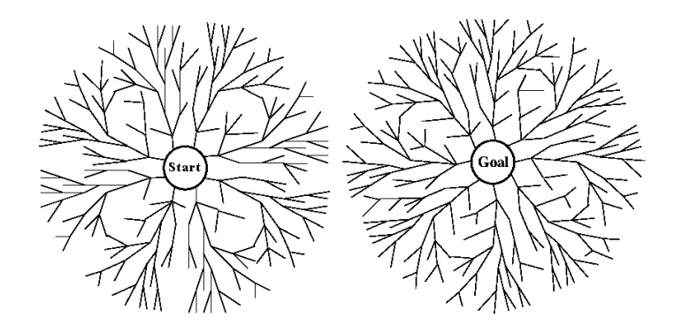
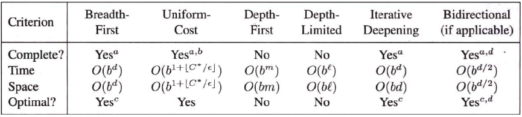
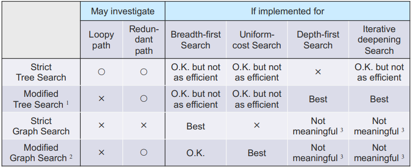

## Depth First Search

- Frontier 가 스택이다. (LIFO)
- 즉, Frontier의 첫번째에 있는 노드는 제일 깊은 unexpanded 노드다.

### Tree-Search based implementation

- 새로운 State가 조상들 중 하나와 같다면 무한루프 방지를 위해 제거함... 하지만 여전히 중복 경로는 피할 수 없다.
- 적당한 메모리 사용량
- 종종, 각 child에 재귀적으로 구현되기도 함 (Recursive-DLS)
- Graph-Search 기반의 구현은 Explored Set이 Exponential 메모리를 요구하므로 의미 없다.


### Features

- 새로운 state가 ancestors 중 하나와 같다면 제거한다.

> Redundant path는 그대로다.
{: .prompt-danger }

### Evaluation

- Modest memory requirements : $O(bm)$

> $b$ : branching factor, $m$ : maximum depth
{: .prompt-info}

- Takes $O(b^m)$ time
  - $m$ 이 $d$ 보다 훨씬 크면 매우 느림.
  - 하지만, solution들이 모여있다면, BFS보다는 좋음.
- infinite-depth 공간에서는 적용할 수 없다. -> Depth-limited Search 이용

## Depth-Limited Search

- Depth를 $l$ 로 제한하는 DFS
- 일반적으로 Tree-Search로 사용
- 상태 공간의 지름을 찾을 때 이용

### Implementation

```text

function DEPTH-LIMITED-SEARCH(problem, limit) returns a solution, or failure/cutoff
  return RECURSIVE-DLS(MAKE-NODE(problem.INITIAL-STATE), problem, limit)

function RECURSIVE-DLS(node, problem, limit) returns a solution, or failure/cutoff
  if problem.GOAL-TEST(node.STATE) then return SOLUTION(node)
  else if limit = 0 then return cutoff
  else
    cutoff_occurred? <-- false
    for each action in problem.ACTIONS(node.STATE) do
      child <-- CHILD-NODE(problem, node, action)
      result <-- RECURSIVE-DLS(child, problem, limit-1)
      if result = cutoff then cutoff_occurred? <-- true
      else if result != failure then return result
    if cutoff_occurred? then return cutoff else return failure
```

## Iterative Deepening Search

- 상태 공간의 지름을 모를 때, Depth Limit를 증가시키며 탐색

Iterative-lengthening-search: Path-cost limit를 증가시키며 찾음
{: .prompt-info}

### Implementation

```text
function ITERATIVE-DEEPENING-SEARCH(problem) returns a solution, or failure
  for depth = 0 to inf do
    result <-- DEPTH-LIMITED-SEARCH(problem, depth)
    if result != cutoff then return result
```

### Evaluation

- Breadth-first 처럼, Optimal, Complete하다.
  - BFS보단 약간 느리긴 하다..
- Depth-first 처럼 적당한 memory를 요구한다.
- 확장을 많이 하는 경우, 오버헤드가 매우 작다.
- Depth-Limited Search : $\sum{b^d}$의 노드가 생성, $O(b^d)$ 시간, 공간복잡도
- Iterative-Deepening Search : $db + (d-1)b^2 + b^3 + ... + 2b^{d-1} + b^d$, $O(bd)$ 시간, 공간복잡도

## Bidirectional Search

Initial과 Goal State에서 동시에 시작해서, $O(b^{d/2})$ 안에 찾을 수 있음 ($2b^{d/2} << b^d$)




### Issues
- Goal State가 여러개 있는 경우
- Goal State의 정보만 가진 경우
- 새로 생긴 노드가 반대편에도 나타났는지 확인할 효율적인 방법이 필요
- 각 절반에서 사용할 Search Strategy는?

#### Comparing Uniformed Search Strategies



#### Tree Search vs. Graph Search

