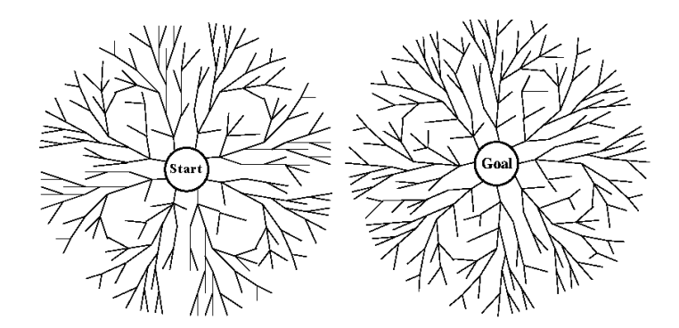
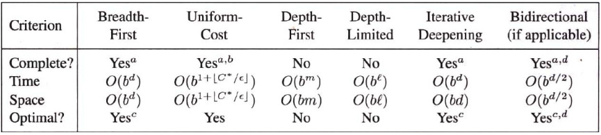
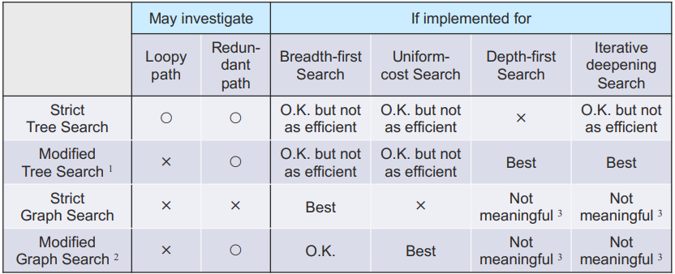

## Bidirectional Search

Initial과 Goal State에서 동시에 시작해서, $O(b^{d/2})$ 안에 찾을 수 있음 ($2b^{d/2} << b^d$)

### Issues
- Goal State가 여러개 있는 경우
- Goal State의 정보만 가진 경우
- 새로 생긴 노드가 반대편에도 나타났는지 확인할 효율적인 방법이 필요
- 각 절반에서 사용할 Search Strategy는?

#### Comparing Uniformed Search Strategies

#### Tree Search vs. Graph Search

