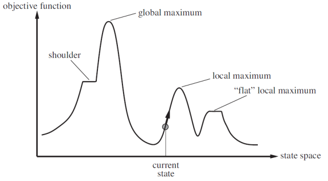

# Local Search Algorithms

발전을 반복하는 알고리즘

Objective function에 따른 최적의 Configuration을 찾는다.

이미 완성된 Configuration에서 시작하여, 더 향상시킨다.

## Hill Climbing Search



- 값이 커지는 곳으로 이동한다.
- Gradient Ascent/Descent Search 라고도 한다.

> Drawbacks: Greedy하게 local maximum만 쫒다가 갇힐 수 있음
{: .prompt-warning}

### Implementation

```text
function HILL-CLIMBING(problem) returns a state that is a local maximum

    current <-- MAKE-NODE(problem.INITIAL-STATE)
    loop do
        neighbor <-- a highest-valued successor of current
        if neighbor.VALUE $\leq$ current.VALUE then return current.STATE
        current <-- neighbor
```

### Possible Solution

- **Stochastic Hill Climbing** : 경사도에 비례한 확률로 오르막길 중 무작위 선택
- **First-Choice Hill Climbing** : 현재 상태보다 더 나은 Successor를 찾을 때까지 무작위 Successor를 생성
- **Random-Restart Hill Climbing** : 무작위 생성된 초기 상태에서 탐색 (8-queens 에서 효과적)

### Complexity

- Hill Climbing Landscape에 따라 성공 여부가 결정된다.
- NP-hard 문제에서는 갇힐 수 있는 국소적인 최댓값이 Exponential 한 수 만큼 있다.
- 조금만 반복하면, 좋은 국소 최적해를 찾을 수 있다.