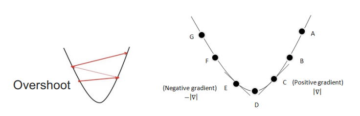

## Continuous State Spaces

Gradient methods는 매 시도마다 $f$를 최대/최소화 시키려 한다.

$$x \larr x\plusmn\alpha\triangledown f(x)$$
$\alpha$: step size, 너무 크면, overshoot
$\triangledown f(x)$ : gradient vector, 0이면 critical point

$f(w)=w^2+1$ 이면, $f'(w)=2w$
$w \larr w-\alpha f'(w)$

파라미터의 값의 변화가 너무 작아지면 중단

### Optimization

**Line Search**: $\alpha$의 크기를 조정함
- $f(x-\alpha \triangledown f(x))$ : 여러 스텝 크기 $\alpha$에 대해 $f$의 값을 계산하고, 가장 작은 함수 값을 만드는 $\alpha$를 선택한다.
- 함수를 빠르게 최소화할 수 있는 스텝 크기를 효율적으로 찾을 수 있다.
- 대부분 $\triangledown f(x)=0$인 닫힌 경우에는 해를 구할 수 없다.