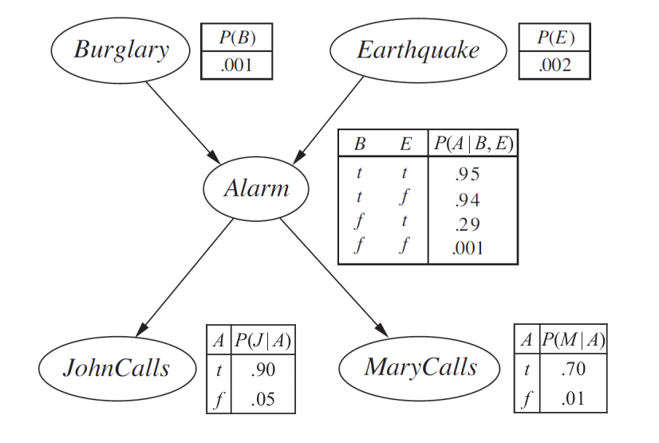

## Exact Inference by Enumeration

Burglary Network로 예를 들면,

$$\bold{P}(B|j, m) = \bold{P}(B, j, m) / P(j, m)$$$$= \alpha \bold{P}(B, j, m)$$ $$= \alpha \sum_e\sum_a\bold{P}(B, e, a, j, m)$$

CPT entries의 곱으로 Full joint를 다시 쓰면

$$P(b|j, m)=\alpha\sum_e\sum_aP(b)P(e)P(a|b,e)P(j|a)P(m|a)$$$$=\alpha P(b)\sum_eP(e)\bold{\sum}_aP(a|b,e)P(j|a)P(m|a)$$

## Variable Elimination Algorithm

## Approximate Inference by Stochastic Simulation
