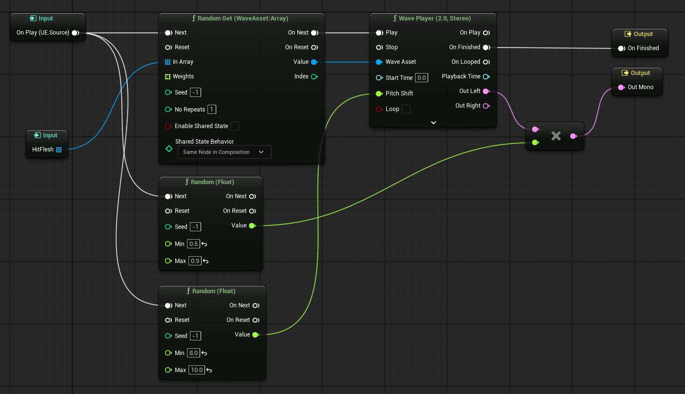
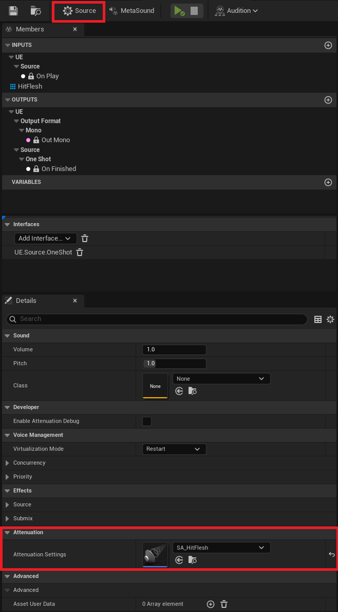

## MetaSound

우선, MetaSound는 언리얼 엔진의 새로운 high-performance의 오디오 시스템이다.
기존 Sound Cue와는 달리 MetaSound는 기본적으로 Digital Signal Processing (DSP) 렌더링 그래프다. 즉, 강력한 procedural audio system을 활용하여 샘플 타이밍 정확성을 제공한다.

> 예를 들면, sample rate 가 48000일 때, 1/48000 초 단위로 컨트롤할 수 있다는 것이다.
{: .prompt-info}

### Example



WaveAsset Array에서 랜덤 효과음을 재생하는 MetaSound

## Sound Attenuation

```cpp
UGameplayStatics::PlaySoundAtLocation(this, HitSound, ImpactPoint);
```

위와 같이 PlaySoundAtLocation으로 MetaSound를 재생을 한다.

그러나 분명 해당 Location에서 소리가 재생되는데, 멀리 떨어진다고 소리가 멀어지진 않는다.

Sound Attenuation (소리 감쇠) 이 없어서 그렇다.



Sound Attenuation 에셋을 만들고, MetaSound의 Source - Details 에서 선택하면 된다.

## reference

[MetaSounds](https://dev.epicgames.com/documentation/en-us/unreal-engine/metasounds-in-unreal-engine)

> 공부할게 너무 많다.. ㅋㅋㅋㅋ
{: .prompt-info}
