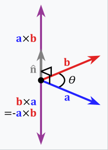
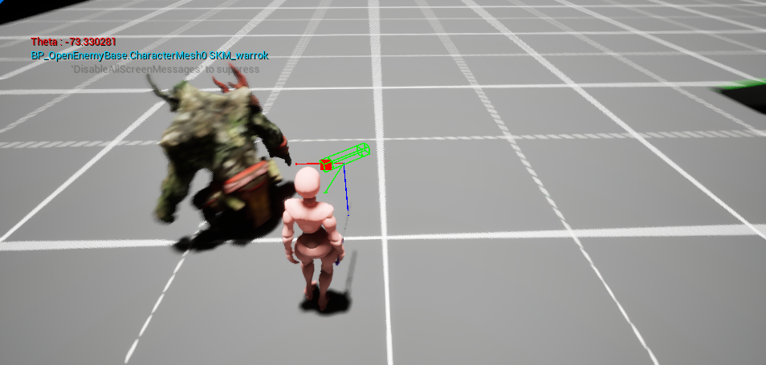

# Overview

3D 게임에서 Hit Reaction 애니메이션을 표현할 때, 피격당한 위치에 따라 다른 애니메이션을 적용해야 하는 경우

## Dot Product?


피격당할 Actor의 기준으로, HitResult의 ImpactPoint를 이용해 방향을 계산할 수 있다.

`HitDirection = ImpactPoint - GetActorLocation()`

으로 HitDirection의 벡터를 구할 수 있고, unit vector라는 전제 하에,

$$HitDirection · ForwardDirection = \cos{\theta}$$

$$\arccos{(\cos{\theta})} = \theta$$

로 $$\theta$$ 를 계산할 수 있다.

그러나 Dot Product로는 Positive Value만 나오기 때문에, Left와 Right를 구별할 수 없다.

### Example
```cpp
const FVector ForwardDirection = GetActorForwardVector();

const FVector HitDirection = (
  FVector(ImpactPoint.X, ImpactPoint.Y, GetActorLocation().Z)
   - GetActorLocation()).GetSafeNormal(); // prevent divide by zero

double theta = FMath::RadiansToDegrees(
  FMath::Acos(
    FVector::DotProduct(HitDirection, ForwardDirection)));

```

## Cross Product



위와같이 Right Handed coordinate system에서의 Cross Product는 위와 같다.

하지만, 언리얼 엔진에서는 Left Handed Coord 시스템을 사용하기 때문에 염두해 두자.



이제 사분각에서 이 $$\theta$$를 기준으로 Front, Back, Left, Right 방향의 HitReaction 애니메이션을 재생할 수 있다.

### Example

```cpp
const FVector ForwardDirection = GetActorForwardVector();

const FVector HitDirection = (
  FVector(ImpactPoint.X, ImpactPoint.Y, GetActorLocation().Z)
   - GetActorLocation()).GetSafeNormal(); // prevent divide by zero

double theta = FMath::RadiansToDegrees(
  FMath::Acos(
    FVector::DotProduct(HitDirection, ForwardDirection)));

const FVector CrossProduct = FVector::CrossProduct(ForwardDirection, HitDirection);

if (CrossProduct.Z < 0)
{
	theta *= -1.f;
}
```

## Reference

[Cross product](https://en.wikipedia.org/wiki/Cross_product)

Udemy - Unreal Engine 5 C++ The Ultimate Game Developer Course
