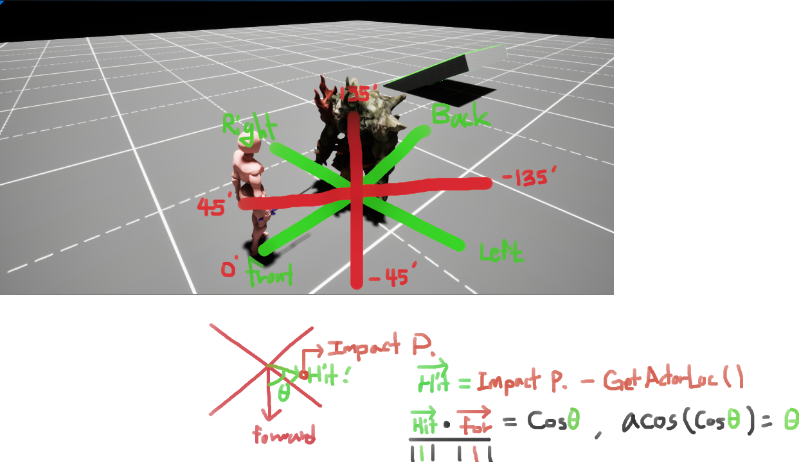

# Overview

3D 게임에서 Hit Reaction 애니메이션을 표현할 때, 피격당한 위치에 따라 다른 애니메이션을 적용해야 하는 경우

## Example

피격당할 Actor의 기준으로, HitResult의 ImpactPoint를 이용해 방향을 계산할 수 있다.

`HitDirection = ImpactPoint - GetActorLocation()`

으로 HitDirection의 벡터를 구할 수 있고, normal vector라는 전제 하에,

$$HitDirection · ForwardDirection = \cos{\theta}$$

$$\arccos{(\cos{\theta})} = \theta$$

로 $$\theta$$ 를 계산할 수 있다.

그리고 이 $$\theta$$ 를 기준, 사분각을 기준으로 Front, Back, Left, Right 방향의 HitReaction 애니메이션을 재생할 수 있다.

