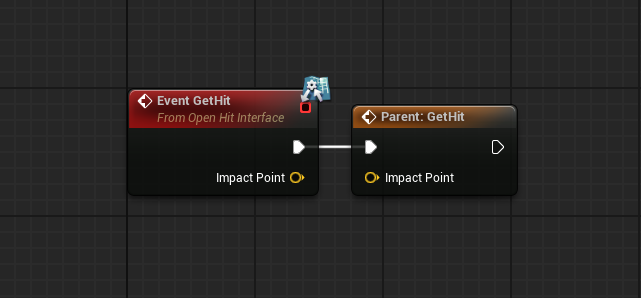

## virtual 함수

```cpp
class UE5_OPENWORLD_API IOpenHitInterface
{
	GENERATED_BODY()

public:
	virtual void GetHit(const FVector& ImpactPoint) = 0;
};
```

기존에는 위와 같이 virtual 함수를 만들고, 해당 Interface 함수를 상속받는 다른 클래스에서 override하는 방법을 사용했다.

그러나 위 방식은 C++에서 제공하는 방법으로, Blueprint 환경에서는 사용하지 못한다.

## UFUNCTION 매크로 활용

```cpp
class UE5_OPENWORLD_API IOpenHitInterface
{
	GENERATED_BODY()

public:
	UFUNCTION(BlueprintNativeEvent)
	void GetHit(const FVector& ImpactPoint);
};
```
`UFUNCTION`의 Specifiers, `BlueprintNativeEvent`를 적용시키면 C++로 기본 동작을 구현하고, 블루프린트에서도 구현을 할 수 있다.

위와 같이 선언하면 우리는 총 3개의 함수를 가지게 된다.

1. `IOpenHitInterface::GetHit`
2. `AMyActor::GetHit_Implementation`
3. `IOpenHitInterface::Execute_GetHit`

> 2번과 3번은 자동 생성된다.
{: .prompt-info}

### `IOpenHitInterface::GetHit`

인터페이스에서 선언한 GetHit(), 구현은 없지만 ***구현을 강제하는 역할***을 한다.

```cpp
UFUNCTION(BlueprintNativeEvent)
void GetHit(const FVector& ImpactPoint);
```

### `AMyActor::GetHit_Implementation`

인터페이스를 상속받는 클래스에서 `GetHit_Implementation`를 override하여 구체적인 구현을 정의.

```cpp
virtual void GetHit_Implementation(const FVector& ImpactPoint) override
{
  UE_LOG(LogTemp, Warning, TEXT("AMyActor::GetHit called at (%f, %f, %f)"), 
    ImpactPoint.X, ImpactPoint.Y, ImpactPoint.Z);
}
```

### `IOpenHitInterface::Execute_GetHit`

`GetHit_Implementation`가 C++에서 오버라이드 되었든, 블루프린트에서 구현이 되었든, 적절한 구현이 실행되는 Static Dispatcher 함수이다.

```cpp
IOpenHitInterface::Execute_GetHit(MyActor, FVector(100.f, 100.f, 100.f));
```

### 블루프린트에서..



좌측 우측 `Parent:GetHit`은 C++ 버전의 GetHit이다!

## Reference

[UFunctions](https://dev.epicgames.com/documentation/ko-kr/unreal-engine/ufunctions-in-unreal-engine)

> 생일~~~
{: .prompt-info}
