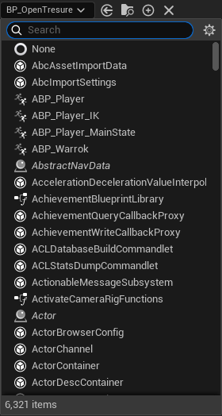

클래스를 파라미터로 사용하는 방법은 여러가지가 있다.

### StaticClass()

```cpp
UClass* MyClass = AMyActor::StaticClass(); // Raw C++ class only
```

제일 먼저 위와 같이 해당 클래스의 포인터를 사용해서 사용할 수 있는데, C++ 클래스만 가능하다.

하지만, 다형성이 없고 정확한 `AMyActor`의 타입만 가져올 수 있다.

### UClass

```cpp
UClass* MyClass = LoadObject<UClass>(nullptr, TEXT("/Game/Blueprints/BP_MyActor.BP_MyActor_C"));	// Can be a C++ / Blueprint class
```
`StaticLoadClass`, `FindObject`, `LoadObject` 등으로 위와 같이 동적 로드가 가능하다. 즉, 플러그인이나 모드 시스템 등 구현도 가능하다!

```cpp
UPROPERTY(EditDefaultsOnly)
UClass* MyClass;	// Can be a C++ / Blueprint class
```

위와 같이 `UPROPERTY` 매크로를 사용해 `UClass` 포인터를 선언해서 사용할 수도 있다.

`UClass` 포인터는 언리얼 엔진의 모든 `UClass` 타입을 나타낼 수 있다.

그 말은..



6000개가 넘는 클래스를 지정할 수 있다는 것이다...

### TSubClassOf

```cpp
UPROPERTY(EditAnywhere)
TSubclassOf<AActor> ActorClass;
```

```cpp
TSubclassOf<AActor> ActorClass;
ActorClass = AMyActor::StaticClass(); // C++, Blueprint available
```

위와 같이 지정하면, `UClass`보다 타입 안전성도 높고 블루프린트에서 클래스를 지정할 때도 파생된 하위 클래스로 제한되어 깔끔해지지만, template 타입을 반드시 지정해야 해서 덜 유연하다.

## Reference

[TSubclassOf
](https://dev.epicgames.com/documentation/ko-kr/unreal-engine/typed-object-pointer-properties-in-unreal-engine)
