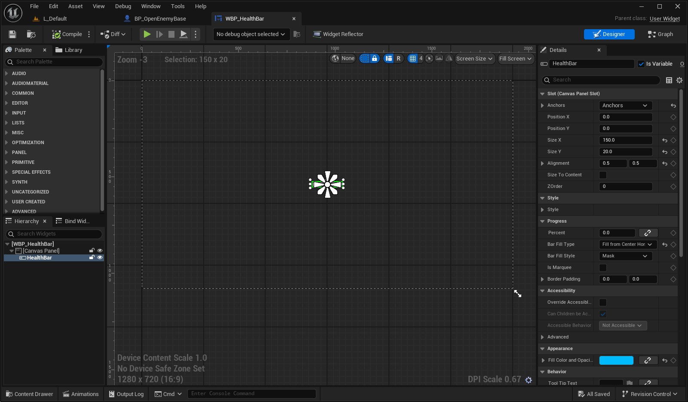
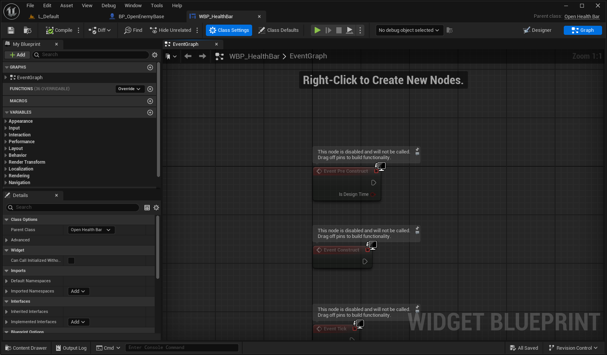
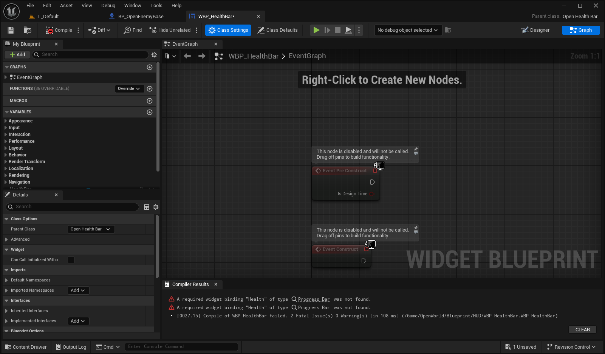
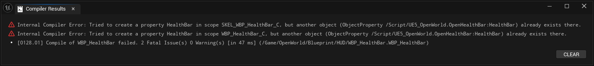
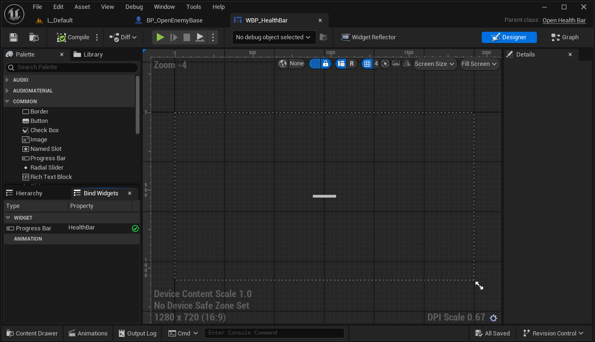

## 1. Widget Blueprint 생성



먼저 에디터에서 위와 같이 Canvas + ProgressBar를 hierarchy에 추가해준다.

또한 해당 ProgressBar는 "체력"이라는 변수를 사용할 것이기 때문에 Detail패널에서 Is Variable을 체크해준다.

> 여기서 ProgressBar의 이름을 알기 쉽게 정한다.
{: .prompt-warning}

## 2. C++ Class 생성

그 다음으로 UserWidget 클래스를 상속받아 C++ 클래스를 생성한다.

```cpp
UCLASS()
class UE5_OPENWORLD_API UOpenHealthBar : public UUserWidget
{
	GENERATED_BODY()
	
public:
	UPROPERTY(VisibleAnywhere, meta = (BindWidget))
	class UProgressBar* HealthBar;
};
```

여기서 아까 Canvas에 추가했던 `ProgressBar` 의 이름인 HealthBar 그대로 `UProgressBar` 포인터의 이름으로 설정한다.



이제 WBP의 Class Setting에서 Parent Class를 이전에 만들었던 C++ 클래스로 선택한다.

### !주의 : Widget Binding Error



아까 ProgressBar의 이름이 일치하지 않으면 Reparenting 과정에서 오류가 생긴다.

### !주의 : Metadata Specifier "BindWidget"

UPROPERTY에 BindWidget 메타데이터 Specifier를 반드시 지정해줘야한다.



지정하지 않으면 위와같은 오류가 생긴다.

내용은 이미 존재하는 프로퍼티로, 한 스코프 안에서 이름이 중복된다는 것이다.

즉, WBP의 Hierachy에 추가한 HealthBar ProgressBar와 C++에서 UPROPERTY 매크로로 선언한 UProgressBar는 서로 다른 오브젝트로 인식하는 것이다.



BindWidget Specifier를 제대로 지정하면, WBP상에서 위와 같이 해당 오브젝트가 제대로 바인딩 되었다고 알려준다. ✅

### 참고 : WidgetComponent.h

```cpp
/** Returns the class of the user widget displayed by this component */
TSubclassOf<UUserWidget> GetWidgetClass() const { return WidgetClass; }

/** Returns the user widget object displayed by this component */
UFUNCTION(BlueprintCallable, Category=UserInterface, meta=(UnsafeDuringActorConstruction=true))
UMG_API UUserWidget* GetUserWidgetObject() const;
```

`WidgetComponent.h`에는 여러 Getter가 있지만, 그 중에서 `GetWidgetClass()`와 `GetUserWidgetObject()`의 차이점은,

전자는 해당 `WidgetComponent`에 의해 표시되는 `UserWidget`의 클래스를 반환하는 것. 후자는 오브젝트를 반환하는 것이다.

## 이후 구현

이후에는 다른 컴포넌트와 같이 생성자에서 생성 및 setupattachment후 원하는 매커니즘대로 

[UProgressBar](https://dev.epicgames.com/documentation/en-us/unreal-engine/API/Runtime/UMG/Components/UProgressBar) Documentation을 참고해서 구현하면 된다!

> 체력이 닳면 SetPercent()나 SetFillColorAndOpacity() 등으로 꾸며주면 되겠다!
{: .prompt-info}
