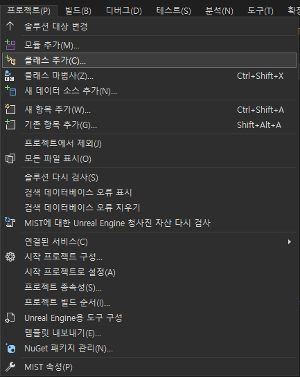
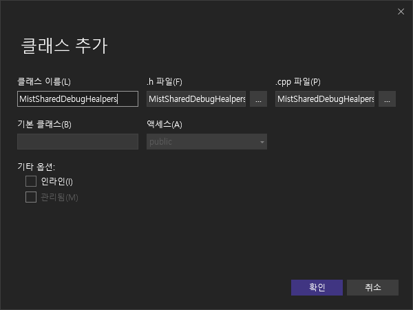
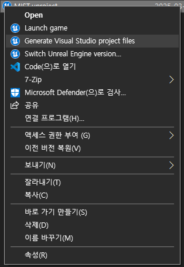

## Overview

언리얼 엔진에서 새로운 헤더파일만 추가해야 할 일이 있다.

주로 ENUM을 정의하거나, 매크로를 정의할 때 사용하는데, 엔진 자체에서는 지원하지 않아서 visual studio 등에서 자체적으로 생성해야한다.

### 1. Visual Studio 에서 클래스 추가

위와 같이 Visual Studio에서 새로운 클래스를 생성한다.

> 프로젝트의 클래스 추가 혹은 클래스 마법사를 사용할 수도 있다.
{: .prompt-info}

### 2. Intermediate - ProjectFiles 에서 파일 옮기기

해당 경로에 생성된 파일을 Source 폴더의 원하는 경로에 옮긴다.

### 3. .uproject 파일로 프로젝트 파일 재생성

그러면 솔루션에서 새로 만든 클래스가 제대로 보이고, .h 파일만 남겨놓고 싶으면 .cpp은 그냥 지우면 된다! 😃
