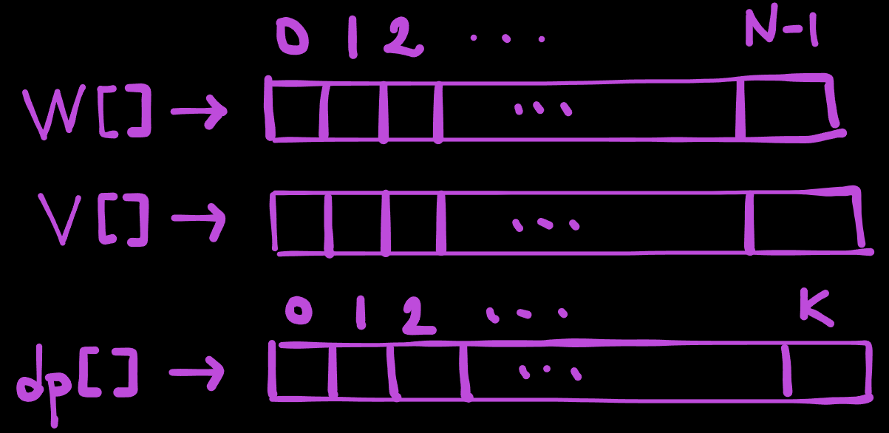
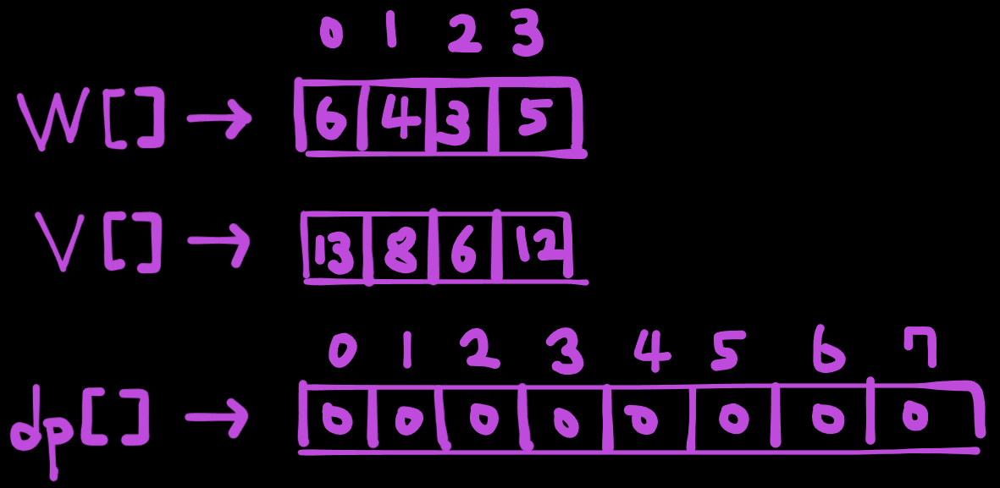
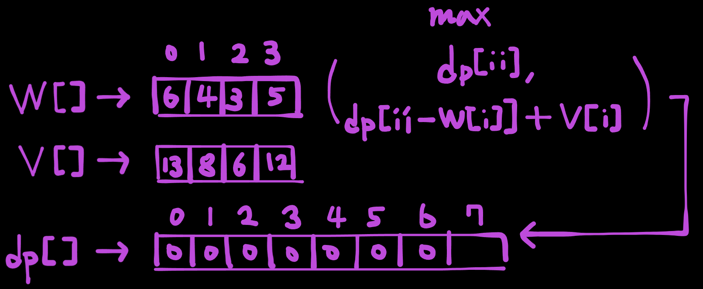
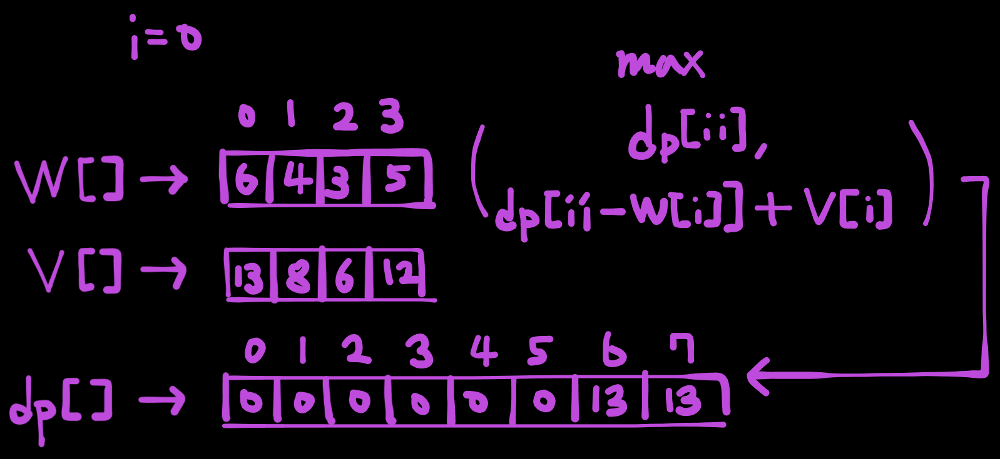
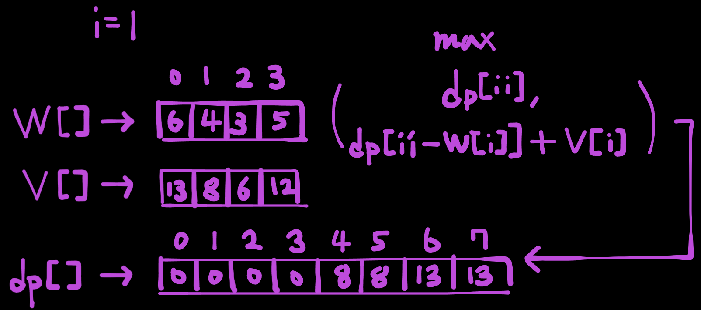
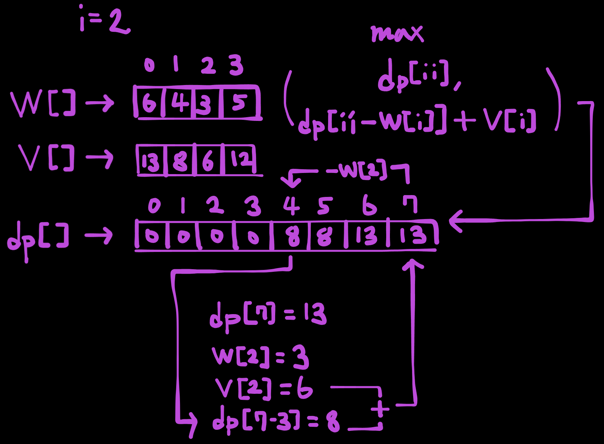

# 개요

> 요즘 언리얼엔진이랑 게임 수학을 공부하고 있는데, 슬슬 알고리즘 문제도 풀어보려 한다..
{: .prompt-info}

[BOJ 12865 - 평범한 배낭](https://www.acmicpc.net/problem/12865)

워낙 유명한 다이나믹 프로그래밍 문제인 0-1 Knapsack Programming이다. 2차원 dp 테이블로 해결할 수 있지만, bottom-up 방식으로 접근하는 방법도 있다.

주어지는 조건은 물건의 개수 N과 가방이 수용할 수 있는 최대 무게 K이다.

## Implementaion

```cpp
#include <iostream>
#include <vector>

using namespace std;

int main()
{
    int N, K;
    cin >> N >> K;

    vector<int> W(N), V(N);
    for (int i = 0; i < N; i++)
        cin >> W[i] >> V[i];

    vector<int> dp(K+1, 0);
    for (int i = 0; i < N; i++)
        for (int ii = K; ii >= W[i]; ii--)
            dp[ii] = (W[i] > ii) ? dp[ii] : max(dp[ii], dp[ii - W[i]] + V[i]);
    cout << dp[K];
    return 0;
}
```

## 접근



먼저 컨테이너는 위와 같이 할당한다.

`W[]`는 물건들의 무게 vector

`V[]`는 물건들의 가치 vector 이다.

`dp[]`는 가방에 넣을 수 있는 최대 무게 + 1 만큼 할당한다.

우선 예제 입출력을 확인하자.

```text
4 7
6 13
4 8
3 6
5 12
```

```text
14
```



초기화하면 위와 같다.



이제 여기서 `max(dp[ii], dp[ii - W[i]] + V[i])` 에 대한 설명을 하자면,

`dp[]`의 element는 기본적으로 무게 `ii`에서 가질 수 있는 최대 가치이다.

`max`의 첫 번째 parameter `dp[ii]`는 그럼? 무게 여유가 `ii`만큼 있을 때, 최대 가치이다.

> 물론 지금은 아직 업데이트되지 않아서 모두 0이지만..
{: .prompt-info}

`max`의 두 번째 parameter `dp[ii - W[i]] + V[i]`는 현재 살펴보고 있는 물건의 무게를 제외했을 때의 최대 가치 + 지금 살펴보고 있는 물건의 가치이다.

`i = 0`일 때를 살펴보자,



> `dp[-1]`, `dp[-2]` 와 같은 경우를 방지하기 위해 `W[i] > ii ?` 삼항 연산자를 사용한다.
{: .prompt-info}

`i = 1`일 때를 살펴보자.



여기까지는 별 일이 안일어난다..



하지만 여기 `i = 2`일 때를 살펴보면,

`i = 1`일 때, `dp[4]`를 8로 업데이트했다.

그러면, 물건2의 무게가 3이니까, `dp[7-3]`일 때 최대로 담을 수 있는 가치를 알아보면, `i = 1`에서 업데이트 했듯, 8이다.

그 때, 물건2의 가치가 6이니까, `dp[7] = max(dp[7], dp[4] + 6) = max(13, 8 + 6)` 이다.

즉 `dp[7]`은 14로 업데이트된다.

이런식으로 모든 iteration을 진행하면, 모든 물건을 살펴봤을 때의 무게에 대한 최대 가치를 얻을 수 있다.

## 결론

사실 2D dp table과 방식은 같다. 1D로 줄일 수 있는 이유는, 2D dp table에서도 같은 row만 참조하기 때문이다.

이렇게 1D table을 이용하면 조금 더 최적화된 Knapsack problem을 해결할 수 있다!


## reference

[Stackoverflow - 0/1 Knapsack Dynamic Programming Optimization, from 2D matrix to 1D matrix](https://stackoverflow.com/questions/17246670/0-1-knapsack-dynamic-programming-optimization-from-2d-matrix-to-1d-matrix)
