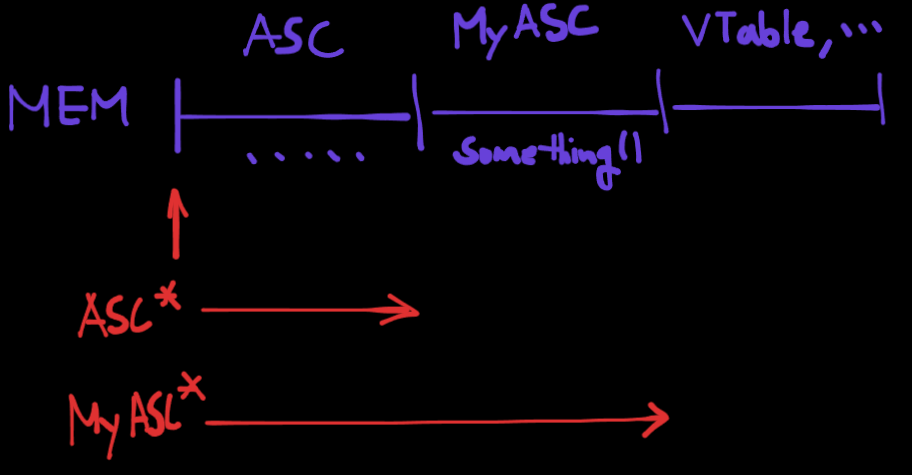

## Overview

언리얼 엔진을 사용하면서 굉장히 많은 클래스를 사용한다.

대부분의 클래스는 기본적으로 UObject를 상속받으며, APawn, ACharacter, UUserWidget 등 다양한 클래스를 상속받아 subclass들을 만들어 활용한다.

상황에 따라서 parent class 포인터를 만들고, 다른 곳에서는 child class에서 선언한 무언가를 활용하는 경우도 많다.

이것이 어떻게 가능한지는 메모리 구조를 이해하면 쉽게 이해할 수 있다.

## 클래스 상속과 캐스팅

```cpp
// MyClass.h
UPROPERTY()
TObjectPtr<UAbilitySystemComponent> AbilitySystemComponent;
```

먼저 위와 같이 `UAbilitySystemComponent` 포인터 변수를 선언한다고 하자.

```cpp
// MyAbilitySystemComponent.h
UCLASS()
class XXX_API UMyAbilitySystemComponent : public UAbilitySystemComponent
{
  ...
  void Something();
  ...
}
```

그리고 아래와 같이 기존 `UAbilitySystemComponent` 클래스를 상속받는 `UMyAbilitySystemComponent` 클래스를 정의했다고 하자.

결론부터 말해서,

```cpp
// MyClass.cpp
Cast<UMyAbilitySystemComponent>(AbilitySystemComponent)->Something();
```
는 항상 안전하진 않다.
`Cast<>`는 **"runtime"** 에 타입을 확인하고, 실패할 경우 `nullptr`를 반환하기 때문에 반드시 체크를 해야 한다.

그 이유는, `AbilitySystemComponent` 포인터 변수가 실제 가리키는 객체가 `UAbilitySystemComponent` 타입일수도, `UMyAbilitySystemComponent` 타입일수도 있기 때문이다.

즉, 실제 어떤 타입의 객체인지는 아직 모르고, 캐스팅은 단순히 **"포인터의 해석 방식을 변환하는 것"** 이다.

(물론, `reinterpret_cast`처럼 단순히 포인터 해석을 바꾸는건 아니고, `IsA(UMyAbilitySystemComponent::StaticClass())` 로 확인한다.. 개념이 그렇다는 것.)

### 1. 캐스팅이 가능한 경우 ✅
```cpp
AbilitySystemComponent = NewObject<UMyAbilitySystemComponent>();
Cast<UMyAbilitySystemComponent>(AbilitySystemComponent)->Something();
```
이 코드는 실행 가능하다. 그 이유는, 포인터는 `UAbilitySystemComponent타입을` 가리키는 포인터 변수지만, 실제 객체는 `UMyAbilitySystemComponent` 클래스로, 메모리 블럭이 완전하기 때문이다.

### 2. 캐스팅이 불가능한 경우 ⛔
```cpp
AbilitySystemComponent = NewObject<UAbilitySystemComponent>();
Cast<UMyAbilitySystemComponent>(AbilitySystemComponent)->Something();
```
이 코드는 실행 불가능하다. 실제 객체 자체가 `UAbilitySystemComponent`이기때문에, 해당 메모리 블럭에는 `UMyAbilitySystemComponent`에 구현된 변수와 함수가 존재하지 않는다.

## 메모리 구조



위 메모리 구조는 `UMyAbilitySystemcomponent` 클래스의 메모리 블록이다. parent class ASC의 정보도 있지만, MyASC 클래스의 정보도 가지고있다. 따라서 포인터를 캐스팅해도 전혀 문제가 없지만, `UAbilitySystemcomponent` 클래스의 메모리 블록에서는 불가능한것이다.

> vtable는 virtual 함수에 대한 테이블이다.
{: .prompt-info} 
